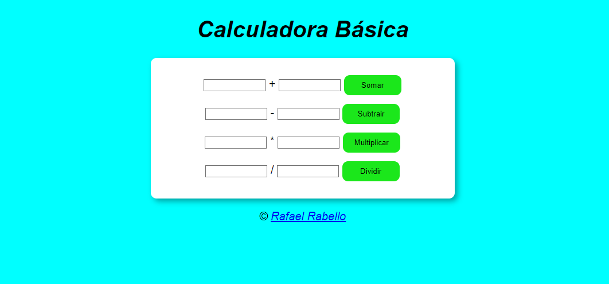

# Calculadora Básica

Projeto feito com o objetivo de criar uma calculadora com o objetivo de Somar, Subtrair, Multiplicar e Dividir dois números.

  <a href="#-tecnologias">Tecnologias</a>&nbsp;&nbsp;&nbsp;|&nbsp;&nbsp;&nbsp;
  <a href="#-projeto">Projeto</a>&nbsp;&nbsp;&nbsp;|&nbsp;&nbsp;&nbsp;
  <a href="#-contato">Contato</a>&nbsp;&nbsp;&nbsp;

  

 

## 🚀 Tecnologias

Esse projeto foi desenvolvido com as seguintes tecnologias:

- HTML e CSS
- JavaScript 
- Git e GitHub

## 💻 Projeto

Calculadora Básica feita em JavaScript

[🔗 Clique aqui para acessar](https://rafaelrabello.github.io/Calculadora-basica/)

# 📱 Contato
rafaeluzan@live.com
